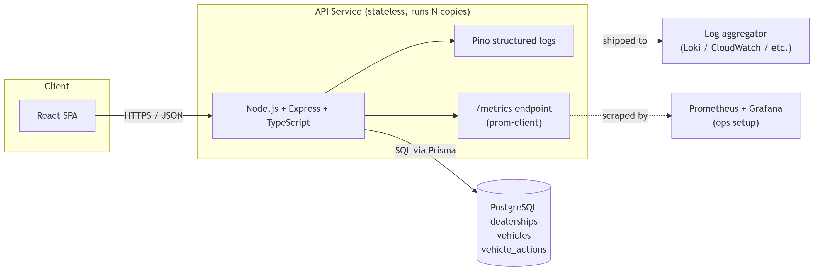
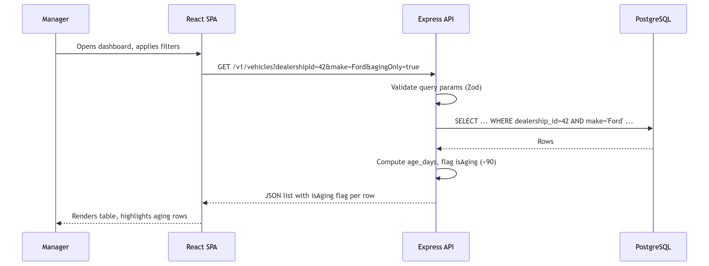

# Intelligent Inventory Dashboard - System Design Document

**Scenario:** B - Intelligent Inventory Dashboard

**Author:** Duy Nguyen

**Date:** April 29, 2026

---

## 1. The problem in plain English

Dealership managers need a single screen that shows every vehicle on their lot. They want to filter it (by make, model, age), they want cars that have been sitting too long - "aging stock", more than 90 days - to stand out, and they want to be able to write down what they plan to do about each one (e.g. *"Price Reduction Planned"*). That note must persist: if they refresh the page or come back tomorrow, it's still there.

So at its core this is a CRUD app with one interesting business rule (the aging flag) and one interesting filtering surface. I designed it to match that reality, not to look like a system five times its size.

---

## 2. Assumptions

The brief is intentionally vague. These are the calls I made - happy to revisit any of them.

- **Multi-dealership from day one.** Every vehicle and every action belongs to one `dealershipId`. Filters and queries are always scoped to a dealership. I won't build full auth in this challenge, but the data model is ready for it.
- **"Age" = `now − received_at`.** Each vehicle has a `received_at` timestamp set when it arrives in the dealership's inventory. The 90-day threshold is a config value, not a magic number sprinkled through the code.
- **Inventory is read-heavy.** Managers view the dashboard far more often than vehicles arrive or leave. I optimise for fast reads and simple writes.
- **One current status per vehicle, plus history.** Each vehicle has one *current* action/status, plus an append-only log of past changes. The history is cheap to model and pays back the first time someone asks "who changed this and when?".
- **Realistic scale.** A dealership has hundreds to a few thousand vehicles. Even a chain has dozens of dealerships, not thousands. This is not a web-scale problem and I'm not pretending it is.

---

## 3. Architecture diagram



A single stateless service in front of one database. When traffic grows, I run more copies of the API behind a load balancer; the database scales vertically and (later) with read replicas.

---

## 4. Component roles

### React SPA (frontend)
The screen the manager actually uses. Owns the filter UI, the table, the aging highlight, and the form to edit a vehicle's action. Talks to the backend over REST. For this submission I provide an OpenAPI spec and cURL examples instead of building the UI.

### Express API
The brain of the system. Owns the business rules - what counts as aging, what statuses are valid, how filters combine. Completely stateless: no in-memory sessions, no caches that matter; the database is the source of truth.

### PostgreSQL
The source of truth. Stores dealerships, vehicles, and the per-vehicle action history. The right shape of database for this problem because the data has clear foreign-key relationships and the queries are mostly filters and joins.

### Pino (logger)
Emits structured JSON logs for every HTTP request and every business event (e.g. `vehicle.action.updated`). Every log line carries a `requestId` so I can trace one request across many lines.

### prom-client (metrics)
Exposes a `/metrics` endpoint in Prometheus format. The standard RED triad - Rate, Errors, Duration - per route. Enough to answer *"is the API healthy right now?"* without grepping logs.

---

## 5. Data flow

### Read flow - "Show me my inventory, filtered"



**Key decision:** the `isAging` flag is **computed on read**, not stored. That means it's always correct, and I never need a cron job to "refresh aging stock" each night. The cost is one extra subtraction per row, which is nothing.

### Write flow - "Log an action on an aging vehicle"

```
PATCH /v1/vehicles/{id}/action
body: { "status": "PRICE_REDUCTION_PLANNED", "note": "Drop price by 5%" }

1. Validate body against an allowed status enum (Zod).
2. In one DB transaction:
     - INSERT a row into vehicle_actions (immutable history).
     - UPDATE current_status / note / updated_at on the vehicle row.
3. Emit structured log:
     { event: "vehicle.action.updated", vehicleId, dealershipId,
       oldStatus, newStatus, userId, requestId }
4. Return the updated vehicle.
```

I keep both an append-only history table **and** a denormalised `current_status` column on `vehicles`. The history is for audit; the column is so the dashboard query stays a single `SELECT` with no join.

---

## 6. Data model

```
dealerships
  id            pk
  name          text
  timezone      text

vehicles
  id                          pk
  dealership_id               fk -> dealerships.id
  vin                         text, unique
  make, model, year, trim     text / int
  price                       numeric
  received_at                 timestamptz
  current_status              enum, nullable
  current_status_note         text, nullable
  current_status_updated_at   timestamptz, nullable

vehicle_actions
  id              pk
  vehicle_id      fk -> vehicles.id
  dealership_id   fk -> dealerships.id   (denormalised for easy filtering)
  status          enum
  note            text
  created_by      text   (userId placeholder)
  created_at      timestamptz
```

**Indexes that matter:**
- `vehicles (dealership_id, received_at)` - covers the dashboard list and the aging filter
- `vehicles (dealership_id, make, model)` - covers the most common filter combo
- `vehicle_actions (vehicle_id, created_at DESC)` - covers the audit history view

---

## 7. API surface (high level)

| Method | Path                          | Purpose                                          |
|--------|-------------------------------|--------------------------------------------------|
| GET    | `/health`                     | Liveness probe (process is up)                  |
| GET    | `/ready`                      | Readiness probe (DB reachable)                  |
| GET    | `/metrics`                    | Prometheus scrape endpoint                      |
| GET    | `/v1/vehicles`                | List + filter: `dealershipId`, `make`, `model`, `minAgeDays`, `agingOnly`, `limit`, `cursor` |
| GET    | `/v1/vehicles/:id`            | Single vehicle + recent action history          |
| PATCH  | `/v1/vehicles/:id/action`     | Update current action/status                    |
| GET    | `/v1/vehicles/:id/actions`    | Full action history for a vehicle               |

Versioned under `/v1` so future breaking changes don't kill existing clients. Full contract in `openapi.yaml`.

---

## 8. Technology choices and why

I deliberately picked a small, boring stack. Boring tech is easier to maintain and easier for a reviewer to read.

| Choice                            | Why                                                                                                  |
|-----------------------------------|------------------------------------------------------------------------------------------------------|
| **Node.js + Express + TypeScript** | I'm productive in it. TypeScript catches a lot of bugs at compile time. Express is the obvious default for a small REST API. |
| **PostgreSQL**                    | Relational data with clear foreign keys. Strong filtering and indexing. Mature, hosted everywhere.   |
| **Prisma (ORM)**                  | Typed queries, painless migrations, good DX. I can still drop to raw SQL when I need to.             |
| **Zod**                           | Validates request bodies and query params. The Zod schema is also the source of the TypeScript type - one source of truth. |
| **Pino**                          | Fast structured JSON logging. Plays nicely with any modern log aggregator.                          |
| **prom-client**                   | The de-facto Prometheus client for Node. Two lines of setup.                                        |
| **Jest + Supertest**              | Standard pairing: Jest for unit tests, Supertest for HTTP integration tests against the real Express app. |
| **Docker + docker-compose**       | One command to spin up API + Postgres locally. Same image in CI and prod.                           |

### Things I deliberately did *not* pick

- **No microservices.** One service is the right size for this.
- **No message queue (Kafka, RabbitMQ).** Nothing here is async enough to justify one.
- **No Redis cache.** Postgres with the right indexes will handle this load. I'd add a cache when a metric tells me to, not before.
- **No GraphQL.** The query patterns are simple and well-known; REST is less work for both sides.
- **No Kubernetes** for this submission. Docker on a single VM, or a managed platform like Fly.io / Render, is plenty for the size of the problem.

I'd rather start small and add things when I have evidence I need them, than build a kit-bag of tools I have to maintain on day one.

---

## 9. Non-functional concerns

**Scalability.** The API is stateless, so when one box isn't enough I run N of them behind a load balancer. Postgres scales vertically a long way; the next step after that is read replicas (this workload is read-heavy, so replicas help a lot).

**Performance.** Two queries dominate: list vehicles, and update an action. Both are covered by the indexes in section 6. The list endpoint is paginated (`limit` + cursor) so the worst case is bounded. `isAging` is computed at query time so there's no background job to keep in sync.

**Reliability.** Few moving parts: stateless API + managed Postgres. `/health` and `/ready` give the load balancer something honest to ask before sending traffic. Database migrations run in CI, never by hand. All writes happen inside a transaction, so a half-applied action update can't happen.

**Maintainability.** Clear layered structure: `routes → controllers → services → repositories`. Business rules (e.g. "aging means more than 90 days") live in **one** place - the service layer - not scattered through SQL or the frontend. TypeScript types flow end-to-end.

---

## 10. Observability

The minimum I need to debug a 3am page, in order of usefulness:

### 1. Structured logs
Every request gets a `requestId` (assigned by middleware). Every log line carries it. So when a manager says *"my dashboard broke at 14:32"*, I find their `requestId` and see exactly what the request did:

```json
{
  "level": "info",
  "ts": "2026-05-04T14:32:11.204Z",
  "requestId": "abc-123",
  "msg": "vehicle.action.updated",
  "vehicleId": 99,
  "dealershipId": 42,
  "oldStatus": null,
  "newStatus": "PRICE_REDUCTION_PLANNED",
  "userId": "u_42"
}
```

### 2. RED metrics on every endpoint
- `http_requests_total{route, method, status}` - **R**ate
- `http_requests_total{..., status=~"5.."}` - **E**rrors
- `http_request_duration_seconds_bucket{route}` - **D**uration (histogram → p50/p95/p99)

That's enough for a basic Grafana dashboard: requests per second, error rate, latency percentiles per endpoint. I'd also add one business metric: `vehicle_action_updates_total{status}` so I can see what managers actually do.

### 3. Health endpoints
- `GET /health` - process is alive (always 200 if up)
- `GET /ready` - process can serve traffic (checks DB connectivity)

### 4. Tracing - deliberately deferred
Distributed tracing (OpenTelemetry → Jaeger/Tempo) is great, but with one service it's overkill - the `requestId` in logs covers the actual debugging need. The moment a second service shows up, that changes and I add it.

### Alerts I'd set if this were prod
- 5xx rate > 1% for 5 minutes
- p95 latency on `GET /v1/vehicles` > 500ms for 5 minutes
- `/ready` failing for > 1 minute

---

## 11. Testing strategy

- **Unit tests** on the service layer - especially `isAging(vehicle, now)` and the filter-combination logic. These are pure functions and the most likely place for an off-by-one or timezone bug.
- **Integration tests** with Supertest, hitting the real Express app and a disposable Postgres (Testcontainers, or a CI `docker-compose` service). At least one test per acceptance criterion in the brief.
- **Contract test** that the running API matches `openapi.yaml`, so the spec doesn't drift from reality.

I aim for high coverage on the service layer (where the business logic is) and don't chase coverage on plumbing.

---

## 12. What I'd add next (deferred on purpose)

Calling these out so the reviewer can see I know they exist - I just don't think they belong in v1:

- Real auth (OIDC / JWT) and per-dealership authorisation
- Rate limiting on the action endpoint
- A read cache if dashboard latency ever creeps up
- Distributed tracing (OpenTelemetry) once there's more than one service
- Outbox pattern + event publishing if other systems need to react to status changes
- CSV export, bulk actions, image uploads for vehicles

---

## 13. How I used GenAI in the design phase

I used Claude with Gemini 3.1 Pro as a **sparring partner**, not an author. My loop:

1. **I wrote the problem in my own words first.** Forced me to actually understand it before letting an AI talk at me.
2. **I asked for critique, not solutions.** Prompts like *"here is my proposed data model - what am I missing?"* and *"what are the failure modes of computing `isAging` at query time vs. as a stored column?"*. This surfaced things I would have missed (e.g. *"what timezone is `received_at` in?"*).
3. **I generated long lists, then cut them.** I asked for *"every observability signal you'd want for a system like this"* and then deleted about 70% of it because most of it was overkill at this size. Picking what *not* to include was my job.
4. **I sanity-checked my technology picks by asking for arguments against them** - *"why might Redis be a bad choice here?"* - and used the answers to write the "things I deliberately did not pick" section honestly.
5. **I verified everything.** Diagrams I redrew myself in Mermaid so I knew every arrow. SQL indexes I checked against `EXPLAIN` plans on seeded test data, not on the model's word.

### Where I overruled the AI

- It suggested a separate `aging_stock` materialised view. I rejected it - `vehicles` is small, computing on read is simpler, and a materialised view introduces staleness for no real win at this size.
- It suggested OpenTelemetry + Jaeger from day one. Overkill for a single service. Logs + metrics are enough; I noted tracing as deferred.
- It wanted to split the system into "inventory-service" and "actions-service" microservices. Two services for one team and one database is just operational tax with no benefit.

### What stayed mine

The assumptions in section 2, the scope cuts in section 12, and every "why I didn't pick X" call. The AI is good at expanding options; the engineering judgement is choosing which ones to throw away. That's the part of the work that has my name on it.
